# Artificial Linux – Architecture

This document describes how the distribution is built and how the Small Language Model (SLM) is integrated into the OS.

## High-level overview

Artificial Linux is built in layers: a **host environment** (macOS + QEMU or native Linux), a **Linux From Scratch (LFS)** base plus **Beyond LFS (BLFS)** extensions, and an **AI fabric** that runs the SLM as a system service and wires it into the shell, build process, and (optionally) the kernel via eBPF and BPF LSM.

```mermaid
graph TB
    subgraph host [Host macOS or Linux]
        IDE[Cursor, VS code]
        Convert[convert-model.sh]
        QEMU[QEMU VM]
    end

    subgraph vm [Build VM]
        LFS[LFS Base]
        BLFS[BLFS]
        Kernel[Kernel BPF/BTF/LSM]
    end

    subgraph ai [AI Fabric]
        Llama[llama.cpp Server]
        Systemd[systemd Services]
        Ask[ask Gateway]
        Shell[Shell Integration]
        eBPF[eBPF Monitor]
        LSM[BPF LSM Guard]
    end

    IDE(vs code or cursor) -->|Remote SSH| QEMU
    Convert -->|GGUF| Llama
    QEMU --> LFS
    LFS --> BLFS
    LFS --> Kernel
    BLFS --> Llama
    Llama --> Systemd
    Systemd --> Ask
    Ask --> Shell
    Kernel --> eBPF
    Kernel --> LSM
    eBPF --> LSM
```



## Build pipeline

### Phases (scripts 00–10)

| Phase | Script | Purpose |
|-------|--------|---------|
| 0 | `00-setup-vm.sh` | Create/boot QEMU VM (Debian netinst), SSH on port 2222 |
| 1 | `01-prepare-host.sh` | Verify/install LFS host deps (gcc, make, etc.) |
| 2 | `02-create-lfs-user.sh` | Create `/mnt/lfs`, `lfs` user, directory layout |
| 3 | `03-build-toolchain.sh` | Cross-toolchain (binutils, gcc, glibc, linux-headers) |
| 4 | `04-build-chroot.sh` | Chroot and build LFS base (Ch 7–8) |
| 5 | `05-build-kernel.sh` | Kernel with BPF, BTF, LSM fragment from `config/kernel.config` |
| 6 | `06-configure-boot.sh` | GRUB, fstab, hostname `artificial-linux` |
| 7 | `07-build-blfs.sh` | CMake, Git, cURL, OpenBLAS, jq, Clang/LLVM, libbpf |
| 8 | `08-build-inference.sh` | Build llama.cpp, install GGUF as `/usr/share/models/artificial-linux-slm.gguf` |
| 9 | `09-install-ai-fabric.sh` | Deploy systemd units, `ask`, shell scripts, eBPF, slm-guard |
| 10 | `10-create-iso.sh` | Branding + bootable ISO |

State is stored in `build/.alfs-state`; `build-all.sh` can resume from a phase (e.g. `ALFS_FROM=05`).

### Configuration

- **config/alfs.conf**: `LFS`, `MAKEFLAGS`, package versions and download URLs (LFS 12.4-systemd).
- **config/kernel.config**: Kernel fragment for `CONFIG_BPF`, `CONFIG_DEBUG_INFO_BTF`, `CONFIG_BPF_LSM`, `CONFIG_LSM=...,bpf`, cgroups.
- **config/qemu.conf**: VM memory, CPUs, disk, SSH port, ISO URL.

## Model and conversion

- **Supported models**: TinyLlama-1.1B-Chat-v1.0 (default), or Granite-4.0-Micro when conversion is supported.
- **model/**: HuggingFace-format model (e.g. TinyLlama: `config.json`, tokenizer, weights).
- **convert/convert-model.sh**:
  - Detects model from `config.json` (llama vs Granite) and sets output basename.
  - Uses a dedicated venv with **numpy&lt;2** to avoid NumPy 2.x / PyTorch and llama.cpp converter issues.
  - Converts to f16 GGUF, then quantizes to Q5_K_M with llama-quantize.
- **Output**: `build/gguf/<basename>-Q5_K_M.gguf`. On the target system this is installed as `/usr/share/models/artificial-linux-slm.gguf` so one systemd unit works for any supported model.

## Inference layer

- **llama.cpp**: Built in `08-build-inference.sh` with OpenBLAS. Installed binaries: `llama-server`, `llama-cli`, `llama-quantize`.
- **llm-user**: Dedicated system user (non-login) that runs the inference service.
- **Model path**: `/usr/share/models/artificial-linux-slm.gguf` (written by 08 from `ALFS_GGUF` or from `/tmp/*-Q5_K_M.gguf`).

## AI fabric (systemd and services)

- **slm-server.service**: Runs `llama-server -m /usr/share/models/artificial-linux-slm.gguf --port 8080 --threads 4 --ctx-size 4096` and optional `--system-prompt-file /etc/ai-fabric/system-prompt.txt`. User `llm-user`, `MemoryMax=4G`.
- **ai-fabric.target**: Wants `slm-server`, `slm-guard`, `ebpf-monitor`; pulled in after `multi-user.target`.
- **slm-guard.service**: Runs `slm-guard.sh`, which tails logs (journal or syslog), batches lines, asks the SLM API whether to LOCK; on LOCK, updates the BPF LSM control map via `bpftool`.
- **ebpf-monitor.service**: Runs the user-space eBPF monitor that consumes the execve ring buffer (from `monitor.bpf.o`).

## Ask gateway

- **src/ask/ask.cpp**: C++ binary that sends a prompt to `http://127.0.0.1:8080/completion` (configurable via `ASK_URL`, `ASK_TIMEOUT` or `/etc/ai-fabric/ask.conf`). Does JSON escaping and simple response parsing to print the `content` field. Used by the shell and scripts.
- **Install**: `/usr/local/bin/ask` (built by 09 from `src/ask/` with CMake + libcurl).

## Shell integration

- **/etc/profile.d/ai-fabric.sh** (from `src/shell/ai-shell-profile.sh`): Sets `PROMPT_COMMAND` to run `analyze_error`: on non-zero exit, sends last command to `ask` for a short fix suggestion. Defines `helpme`/`ask-ai` aliases and PS1 `user@artificial-linux:path$`.
- **/etc/profile.d/ai-motd.sh**: On login, optionally pipes `uptime`/`df`/`free` to the SLM for a one-line system summary.
- **/usr/local/bin/ai-make**: Wrapper around `make`; on failure, sends last 20 log lines to `ask` for analysis.

## eBPF and BPF LSM

- **monitor.bpf.c**: Tracepoint `tp/syscalls/sys_enter_execve`; fills a ring buffer with pid, comm, filename. Consumed by user-space `monitor.c` (libbpf).
- **gatekeeper.bpf.c**: LSM hook `lsm/task_alloc`; reads an array map `control_map`; if value is 1 (lockdown), returns `-EPERM` to block new tasks. Updated by `slm-guard.sh` via `bpftool map update`.
- **Build**: Clang for `.bpf.c` → `.o`; kernel must have BTF and BPF LSM enabled (`config/kernel.config`).

## Branding

- **branding/logo.png**: Project logo (hierarchical nodes; used in README and docs).
- **branding/os-release**, **lsb-release**: `NAME="Artificial Linux"`, `VERSION="1.0"`, etc.
- **branding/issue**: Pre-login banner (ASCII art + name/URL). Installed to `/etc/issue` by 09/10.

## Live ISO boot (when is `ask` available?)

Booting the live ISO has two stages:

1. **Initramfs (BusyBox)**  
   The kernel runs `/init` from the initrd. That script mounts the ISO (CD or disk), mounts the squashfs, then runs `switch_root` into the live root and starts `/sbin/init`.  
   If the ISO cannot be mounted (e.g. QEMU was started without `-cdrom` so the ISO is attached as a disk), the script drops you into a **rescue shell** (`~ #`). That shell is **BusyBox only**: there is no `ask`, no llama.cpp, and no full system. Commands like `ask` will report “not found”—that’s expected there.

2. **Full system (after switch_root)**  
   Only after the initramfs successfully mounts the live root and runs `switch_root` do you get the real Artificial Linux system (systemd, `/usr/local/bin/ask`, llama-server, etc.). So **`ask` and other AI commands are only available once you are in the full system**, not in the initramfs rescue shell.

To reach the full system when testing in QEMU, boot with the ISO as the CD:  
`qemu-system-x86_64 -serial stdio -cdrom build/iso/artificial-linux-1.0-live.iso -boot d -m 2G`.

## Directory layout (summary)

```
Artificial Linux/
├── config/          # alfs.conf, kernel.config, qemu.conf
├── scripts/         # 00–10, build-all.sh
├── convert/         # convert-model.sh, requirements.txt
├── src/
│   ├── ask/         # ask.cpp, CMakeLists.txt
│   ├── ebpf/        # monitor.bpf.c, monitor.c, gatekeeper.bpf.c, Makefile
│   ├── shell/       # ai-shell-profile.sh, ai-make, ai-motd.sh, slm-guard.sh
│   └── ai-fabric/   # system-prompt.txt
├── systemd/         # slm-server, slm-guard, ebpf-monitor, ai-fabric.target
├── branding/        # logo.png, os-release, issue, lsb-release
├── model/           # TinyLlama (or other HF model)
├── docs/            # INSTALL.md, ARCHITECTURE.md
└── build/           # gguf/, venv-convert/, llama.cpp/, .alfs-state, iso/
```

## Data flow (SLM usage)

1. **User types a failed command** → shell `PROMPT_COMMAND` runs `ask "command X failed..."` → HTTP to llama-server → response printed as “AI Suggestion”.
2. **User runs `ask "question"`** → same HTTP completion path.
3. **User runs `ai-make` and make fails** → last 20 lines sent to `ask` → SLM suggests fix.
4. **slm-guard** → reads journal/syslog in batches → POST to completion API “is this a threat? LOCK or PASS” → if LOCK, `bpftool map update` on control map → kernel LSM blocks new tasks until map is cleared.
5. **eBPF monitor** → kernel emits execve events to ring buffer → user-space can optionally forward summaries to the SLM for analysis (current code logs to stderr).

This architecture keeps the SLM as a single backend service (`llama-server`) while exposing it through a fixed path (`artificial-linux-slm.gguf`) and the `ask` binary, so switching between TinyLlama and other supported models is a matter of converting/copying the GGUF and reinstalling it as `artificial-linux-slm.gguf`.
